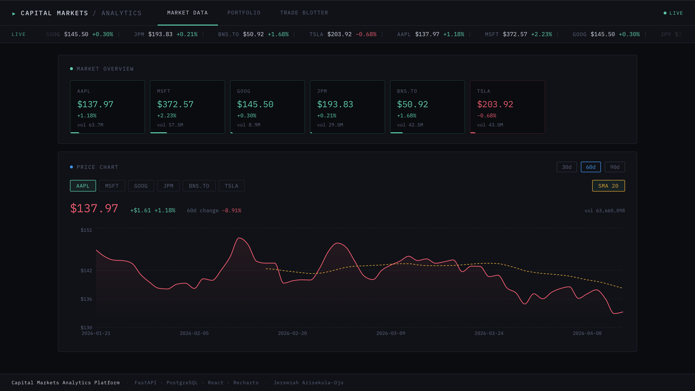

# Capital Markets Analytics Platform

A full-stack financial analytics platform simulating trade monitoring, market data ingestion, and portfolio risk analytics. Built to demonstrate production-grade backend engineering for capital markets systems.

---

## Screenshot



---

## What This Demonstrates

- **Full-stack integration** — React frontend consuming a typed FastAPI REST API backed by PostgreSQL, all containerised with Docker Compose
- **Capital markets domain knowledge** — trade blotter, unrealized P&L, weighted average cost accounting, sector exposure, SMA-20 technical indicator; terminology and data modelling that mirrors real trading desk systems
- **Production API design** — Pydantic v2 request/response contracts, SQLAlchemy ORM with four normalised tables, Alembic migrations, CORS middleware, typed enums for trade side and asset class
- **Test engineering** — 80 pytest tests (46 API integration, 34 unit) at 83% coverage; in-memory SQLite test DB using FastAPI dependency overrides so no Docker is needed to run the suite
- **CI/CD** — GitHub Actions workflow that installs dependencies and runs the full test suite on every push and pull request to `main`
- **Data integrity** — atomic trade execution: every `POST /trades/` inserts a trade row and updates the positions table in a single transaction; oversell protection enforced at the API layer

---

## Tech Stack

| Layer | Technology |
|---|---|
| Backend | Python 3.11, FastAPI 0.111, Uvicorn |
| ORM / Migrations | SQLAlchemy 2.0, Alembic |
| Database | PostgreSQL 16 |
| Frontend | React 18, Vite, Recharts, Axios |
| Testing | pytest, pytest-cov, HTTPX |
| DevOps | Docker, Docker Compose |

---

## Architecture

```
frontend/          React SPA (Vite, port 5173)
│  src/
│  ├── api.js               All backend calls in one place
│  ├── useData.js            Shared fetch hook with cancellation
│  └── components/
│      ├── MarketBar.jsx     Scrolling live ticker strip
│      ├── MarketOverview.jsx  Instrument grid with gain/loss tiles
│      ├── PriceChart.jsx    OHLCV area chart + computed SMA-20 curve
│      ├── PortfolioPnL.jsx  P&L table + sector exposure donut
│      └── TradeBlotter.jsx  Trade log + order submission form

backend/           FastAPI application (port 8000)
│  app/
│  ├── main.py               App entry point, router mounts, CORS
│  ├── models/schemas.py     Pydantic request/response contracts
│  ├── db/
│  │   ├── database.py       Engine, SessionLocal, get_db dependency
│  │   ├── orm_models.py     SQLAlchemy ORM (4 tables)
│  │   └── seed.py           Instruments, 90-day price history, trades
│  └── routers/
│      ├── market.py         Market data endpoints
│      ├── trades.py         Trade blotter endpoints
│      └── portfolio.py      Analytics endpoints
│  alembic/                  Schema migrations
│  tests/                    80 pytest tests
```

---

## Database Schema

```
instruments        — reference data per symbol (symbol, name, sector, asset_class)
trades             — immutable event ledger (symbol, side, qty, price, notional, timestamp)
positions          — current net holding (symbol, quantity, avg_cost, realized_pnl)
market_prices      — daily OHLCV history (symbol, date, open, high, low, close, volume)
```

`trades` and `positions` are kept in sync atomically on every `POST /trades/`: a BUY recalculates the weighted average cost; a SELL books realized P&L and reduces the position.

---

## API Endpoints

**Health**

| Method | Path | Description |
|---|---|---|
| GET | `/` | Health check |

**Market Data**

| Method | Path | Description |
|---|---|---|
| GET | `/market-data/` | Latest price + daily change for all instruments |
| GET | `/market-data/{symbol}` | Latest price for one symbol |
| GET | `/market-data/{symbol}/history?days=60` | OHLCV history (1–365 days) |

**Trade Blotter**

| Method | Path | Description |
|---|---|---|
| GET | `/trades/?symbol=AAPL&side=BUY&limit=50` | Filtered trade log, most recent first |
| GET | `/trades/{id}` | Single trade by ID |
| POST | `/trades/` | Submit a trade — validates symbol, writes ledger row, updates position atomically |

**Portfolio Analytics**

| Method | Path | Description |
|---|---|---|
| GET | `/portfolio/pnl` | Unrealized P&L per position using latest closing price |
| GET | `/portfolio/exposure` | Portfolio weight by sector |
| GET | `/portfolio/moving-average/{symbol}?window=20` | N-day simple moving average from price history |

Full interactive documentation available at `http://localhost:8000/docs` (Swagger UI) once the backend is running.

---

## Running Locally

### Prerequisites
- Docker Desktop
- Python 3.11+
- Node.js 18+

### 1 — Start the database

```bash
docker-compose up -d db
```

### 2 — Run migrations and seed data

```bash
cd backend
pip3 install -r requirements.txt
alembic upgrade head
python3 -m app.db.seed
```

The seed script creates 6 instruments, ~64 trading days of price history per symbol, 13 scripted trades, and 6 positions with computed weighted average costs.

### 3 — Start the backend

```bash
# From the backend/ directory
uvicorn app.main:app --reload
# → http://localhost:8000
# → http://localhost:8000/docs  (Swagger UI)
```

### 4 — Start the frontend

```bash
cd frontend
npm install
npm run dev
# → http://localhost:5173
```

---

## Running the Tests

No Docker required — the test suite uses an in-memory SQLite database.

```bash
cd backend
pip3 install -r requirements.txt
pytest
```

Expected output:

```
80 passed in ~3s

Name                       Stmts   Miss  Cover
----------------------------------------------
app/routers/market.py         43      2    95%
app/routers/portfolio.py      55      1    98%
app/routers/trades.py         53      4    92%
app/models/schemas.py         70      0   100%
...
TOTAL                        401     70    83%
```

Tests are split into two files:
- `tests/test_analytics.py` — 34 unit tests on financial logic (P&L formulas, weighted average cost, realized P&L, SMA, sector weights, price history generation)
- `tests/test_api.py` — 46 end-to-end API tests covering all routes, filters, validation errors, and business rule enforcement (oversell protection, unknown symbol rejection)

---

## Author

Jeremiah Arisekola-Ojo